 

 
 

  

  

 
 
 

⸻
🧠 Floating agent core

<picture>
  <source media="(prefers-color-scheme: dark)" srcset="assets/hero-orbit.svg">
  <source media="(prefers-color-scheme: light)" srcset="assets/hero-orbit-light.svg">
  
</picture>

Save hero-orbit.svg and hero-orbit-light.svg to an assets/ folder in this repo — see the setup note at the bottom of this file.
⸻
🚀 About Me

I'm an AI/ML builder and Master of AI in Business student in Dubai, working at the intersection of agentic AI systems and real business decision-making — multi-agent orchestration, agentic RAG, LLM security, and decision-intelligence platforms, built with production-grade engineering rather than notebooks alone.

current_focus:
  building: "A portfolio of agentic AI products under one domain: Agentic Decision Intelligence"
  stack: "LangGraph agents, FastAPI, Next.js 14, Pydantic v2, zero paid API keys"
  exploring: "AI governance, LLM red-teaming, agent-to-agent protocols, algorithmic bias & AI ethics"
  looking_for: "AI/ML Analyst, Business Analyst & AI Associate roles across the UAE (G42, Presight, Core42)"
  location: "Dubai, UAE"

🎓 Academic Credentials

  

📊 Impact Snapshot

⸻
⚙️ How I Build

<picture>
  <source media="(prefers-color-scheme: dark)" srcset="assets/build-pipeline.svg">
  <source media="(prefers-color-scheme: light)" srcset="assets/build-pipeline-light.svg">
  
</picture>

Every venture in the portfolio follows the same loop: scan the market and score the idea → turn it into a copy-paste master build prompt → ship it with the locked stack → close the loop with tests, evals, and a CLAUDE.md doctrine file.
⸻
🗺️ Academic → Agentic Roadmap

<picture>
  <source media="(prefers-color-scheme: dark)" srcset="assets/roadmap-timeline.svg">
  <source media="(prefers-color-scheme: light)" srcset="assets/roadmap-timeline-light.svg">
  
</picture>

⸻
🛠️ Currently Building

Ṣāni' (صانع)   →  A portfolio-grade agentic coding CLI in Python, built with zero agent
                   frameworks. Core differentiators + 215 tests complete; TUI, sessions,
                   MCP/hooks and packaging in progress.

Wasl AI        →  An agent-to-agent protocol discovery platform. Skills bundle installed,
                   seed registry in place, Phase 0 ready to run.

Goal           →  Bridge a CSE/AI-ML engineering background with an MAIB business
                   education — AI research that ships as usable decision systems.

⸻
🧬 Agentic Decision Intelligence — Portfolio Domain

<picture>
  <source media="(prefers-color-scheme: dark)" srcset="assets/agent-constellation.svg">
  <source media="(prefers-color-scheme: light)" srcset="assets/agent-constellation-light.svg">
  
</picture>

Save agent-constellation.svg and agent-constellation-light.svg alongside hero-orbit.svg in assets/.

Nine ventures, one thesis: decisions get better when agents can research, reason, and act — not just predict.
Venture	Focus	Core Stack	Stage
Halqa AI	14-agent retail retention engine on top of Retail IQ	LangGraph, FastAPI, PostgreSQL	Build-ready
Masar AI	14-agent Agentic RAG over RTA / Dubai Pulse transit data	LangGraph, self-validating YAML eval set	Build-ready
Sentinel AI	LLM/agent red-team platform, OWASP LLM Top 10 coverage	Python, FastAPI, LangGraph	Build-ready
Nexus BI	Autonomous business-analyst copilot (flagship)	LangGraph, FastAPI, Next.js	Build-ready
Muraqib AI	Agentic governance & oversight platform	LangGraph, Pydantic v2	Build-ready
ClaimGuard AI	Agentic claims intelligence	LangGraph, FastAPI	Build-ready
Sakan AI	Dubai real-estate intelligence on DLD open data	LangGraph, PostgreSQL	Build-ready
Wasl AI	Agent-to-agent protocol discovery platform	Python, MCP	In setup
Ṣāni' (صانع)	Agentic coding CLI, no agent framework	Python, 215 tests	In progress

Repos are linked here as each ventures ships from build prompt to public code.
⸻
🏆 Shipped & Public Repos
Project	Focus	Tech Stack	Link
FraudShield AI	Sequence-aware payment fraud detection — LSTM/GRU/CNN + anomaly detection, explainability, business-action recommendations	PyTorch, FastAPI, React, Streamlit	Repo
Project Wafa	Multilingual banking-retention platform turning customer signals into churn risk + transparent, human-reviewed actions	Python, NLP, DistilBERT, Streamlit	Repo
Fatoora AI	Multi-tenant UAE e-invoicing SaaS — tenant isolation, RBAC, expense OCR, VAT workflows	Next.js, TypeScript, Prisma, PostgreSQL	Repo
DARIX AI	Interactive Dubai AI Readiness Index — glassmorphism UI, live scoring, neural-network SVG background	Next.js, TypeScript, Framer Motion	Repo · Live
NL2SQL	Natural-language interface translating business questions into SQL	Python, NLP	Repo
Interactive Portfolio	Production portfolio site — motion-driven case studies, in-browser ML demos	React, TypeScript, Three.js	Live
⸻
🧰 Technology Stack

<picture>
  <source media="(prefers-color-scheme: dark)" srcset="assets/skills-orbit.svg">
  <source media="(prefers-color-scheme: light)" srcset="assets/skills-orbit-light.svg">
  
</picture>

Save skills-orbit.svg and skills-orbit-light.svg alongside the other assets.

AI, Agents & Backend 

Product Engineering 

 

⸻
📈 Engineering Activity

⸻
🐍 Contribution Journey

<picture>
  <source media="(prefers-color-scheme: dark)" srcset="https://raw.githubusercontent.com/krish2105/krish2105/output/github-contribution-grid-snake-dark.svg">
  <source media="(prefers-color-scheme: light)" srcset="https://raw.githubusercontent.com/krish2105/krish2105/output/github-contribution-grid-snake.svg">
  
</picture>

⸻

<b>🎓 Education, recognition & currently learning</b>

 

Education
- Master of AI in Business — SP Jain School of Global Management, Dubai (2025–Present)
- B.Tech in Computer Science Engineering, AI & ML — Manipal University Jaipur (2021–2025)

Recognition
- USD 9,000 Merit Scholarship — SP Jain School of Global Management
- Student Excellence Award — Manipal University Jaipur
- Brilliant Student Award — highest academic performance in B.Tech CSE (AI & ML)

Currently learning
- Multi-agent orchestration patterns and MCP/hooks for agentic tooling
- Responsible GenAI, LLM red-teaming and human-in-the-loop systems
- Production ML, MLOps and cloud deployment foundations

⸻
🤝 Let's Build Something Useful

I enjoy discussing agentic AI, applied machine learning, NLP, FinTech, AI ethics and governance, and business strategy — especially projects where autonomous systems have to earn trust before they earn responsibility.

 

  

🕒 Last synced: <!--LAST_SYNCED-->not yet synced<!--END_LAST_SYNCED--> · kept fresh automatically by a GitHub Action

 

<!--
SETUP NOTE (delete this comment once done):
1. In your krish2105/krish2105 repo, create a folder named `assets`.
2. Upload all TEN SVGs into that folder:
   hero-orbit.svg, hero-orbit-light.svg,
   agent-constellation.svg, agent-constellation-light.svg,
   skills-orbit.svg, skills-orbit-light.svg,
   roadmap-timeline.svg, roadmap-timeline-light.svg,
   build-pipeline.svg, build-pipeline-light.svg
3. Commit to main — GitHub resolves assets/*.svg relative to the repo root
   automatically. The dark file shows for dark-theme viewers, the light
   file for light-theme viewers, via prefers-color-scheme.
4. Upload your resume as resume.pdf to the REPO ROOT (not assets/) so the
   Resume badge near the top links correctly. If you'd rather host it
   elsewhere (Drive, your portfolio site), replace that badge's href with
   your own URL instead.
5. To make the "Last synced" footer auto-update, add the workflow file
   .github/workflows/sync-readme-footer.yml (provided separately) to your
   repo at that exact path. It runs on every push to main, daily at
   midnight UTC, and on manual trigger — it rewrites the text between
   <!--LAST_SYNCED--> and <!--END_LAST_SYNCED--> with the current UTC

time and commits the change back automatically. No setup beyond 
adding the file — GitHub's default token has permission to push 
because the workflow requests contents: write. 
6. All SVGs are self-contained CSS animations (no JS, no external calls), 
so they render identically for every visitor and cost nothing to host. 
-->
