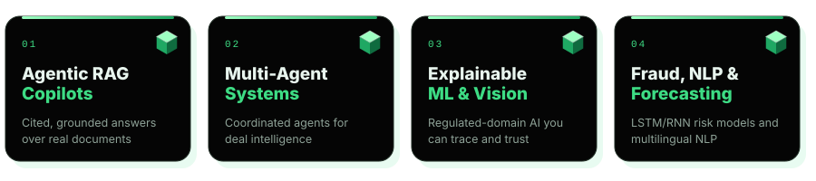
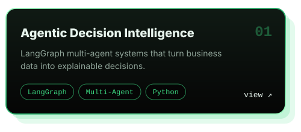
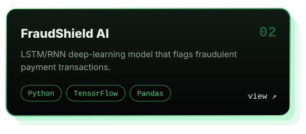
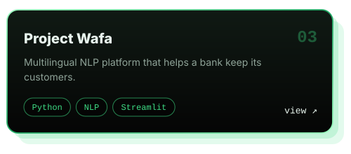
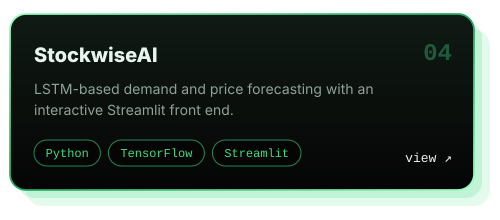
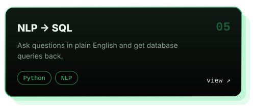
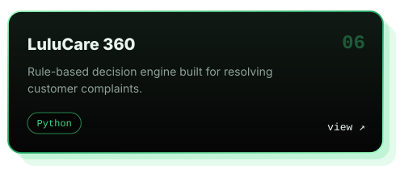

AI/ML Developer building cited agentic RAG copilots, multi-agent systems and explainable ML · MAIB @ SP Jain Dubai · Open to roles in the UAE

  









<a href="https://krishnamathur-ai.vercel.app/"></a>
<a href="https://github.com/krish2105/FraudShield-AI-Deep-Learning"></a>

<a href="https://github.com/krish2105/NLP-Final-project-Wafa"></a>
<a href="https://github.com/krish2105/StockwiseAI-DL-Project"></a>

<a href="https://github.com/krish2105/NLP-NL2-SQL"></a>
<a href="https://github.com/krish2105/NLP-LuluCare360"></a>

See the full case studies on my <a href="https://krishnamathur-ai.vercel.app/">portfolio</a> or browse my <a href="https://github.com/krish2105?tab=repositories">repositories</a>.



  



