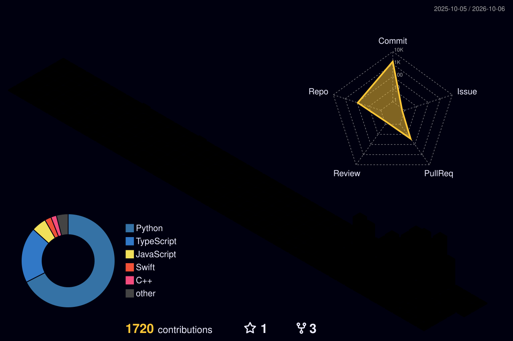

<picture>
  <source media="(prefers-color-scheme: dark)" srcset="./assets/banner-dark.svg">
  <source media="(prefers-color-scheme: light)" srcset="./assets/banner-light.svg">
  
</picture>

AI/ML Analyst building fraud detection, multilingual NLP and forecasting systems · MAIB @ SP Jain Dubai · Open to roles in the UAE

 

<picture>
  <source media="(prefers-color-scheme: dark)" srcset="./assets/terminal-dark.svg">
  <source media="(prefers-color-scheme: light)" srcset="./assets/terminal-light.svg">
  
</picture>

 

<picture>
  <source media="(prefers-color-scheme: dark)" srcset="./assets/h-focus-dark.svg">
  <source media="(prefers-color-scheme: light)" srcset="./assets/h-focus-light.svg">
  
</picture>

<picture>
  <source media="(prefers-color-scheme: dark)" srcset="./assets/focus-dark.svg">
  <source media="(prefers-color-scheme: light)" srcset="./assets/focus-light.svg">
  
</picture>

<picture>
  <source media="(prefers-color-scheme: dark)" srcset="./assets/h-stack-dark.svg">
  <source media="(prefers-color-scheme: light)" srcset="./assets/h-stack-light.svg">
  
</picture>

<picture>
  <source media="(prefers-color-scheme: dark)" srcset="./assets/stack-dark.svg">
  <source media="(prefers-color-scheme: light)" srcset="./assets/stack-light.svg">
  
</picture>

<picture>
  <source media="(prefers-color-scheme: dark)" srcset="./assets/h-work-dark.svg">
  <source media="(prefers-color-scheme: light)" srcset="./assets/h-work-light.svg">
  
</picture>

<a href="https://github.com/krish2105/FraudShield-AI-Deep-Learning"><picture>
  <source media="(prefers-color-scheme: dark)" srcset="./assets/card-fraudshield-dark.svg">
  <source media="(prefers-color-scheme: light)" srcset="./assets/card-fraudshield-light.svg">
  
</picture></a>
<a href="https://github.com/krish2105/StockwiseAI-DL-Project"><picture>
  <source media="(prefers-color-scheme: dark)" srcset="./assets/card-stockwise-dark.svg">
  <source media="(prefers-color-scheme: light)" srcset="./assets/card-stockwise-light.svg">
  
</picture></a>

<a href="https://github.com/krish2105/NLP-Final-project-Wafa"><picture>
  <source media="(prefers-color-scheme: dark)" srcset="./assets/card-wafa-dark.svg">
  <source media="(prefers-color-scheme: light)" srcset="./assets/card-wafa-light.svg">
  
</picture></a>
<a href="https://github.com/krish2105/NLP-NL2-SQL"><picture>
  <source media="(prefers-color-scheme: dark)" srcset="./assets/card-nl2sql-dark.svg">
  <source media="(prefers-color-scheme: light)" srcset="./assets/card-nl2sql-light.svg">
  
</picture></a>

<a href="https://github.com/krish2105/NLP-LuluCare360"><picture>
  <source media="(prefers-color-scheme: dark)" srcset="./assets/card-lulucare-dark.svg">
  <source media="(prefers-color-scheme: light)" srcset="./assets/card-lulucare-light.svg">
  
</picture></a>
<a href="https://github.com/krish2105/lulu-intelligence-dashboard"><picture>
  <source media="(prefers-color-scheme: dark)" srcset="./assets/card-luludash-dark.svg">
  <source media="(prefers-color-scheme: light)" srcset="./assets/card-luludash-light.svg">
  
</picture></a>

More on my <a href="https://github.com/krish2105?tab=repositories">repositories page</a> and <a href="https://krishnamathur-ai.vercel.app/">portfolio</a>.

<picture>
  <source media="(prefers-color-scheme: dark)" srcset="./assets/h-3d-dark.svg">
  <source media="(prefers-color-scheme: light)" srcset="./assets/h-3d-light.svg">
  
</picture>

<picture>
  <source media="(prefers-color-scheme: dark)" srcset="./profile-3d-contrib/profile-night-rainbow.svg">
  <source media="(prefers-color-scheme: light)" srcset="./profile-3d-contrib/profile-green-animate.svg">
  
</picture>

<picture>
  <source media="(prefers-color-scheme: dark)" srcset="./assets/h-connect-dark.svg">
  <source media="(prefers-color-scheme: light)" srcset="./assets/h-connect-light.svg">
  
</picture>

<picture>
  <source media="(prefers-color-scheme: dark)" srcset="./assets/connect-dark.svg">
  <source media="(prefers-color-scheme: light)" srcset="./assets/connect-light.svg">
  
</picture>

<picture>
  <source media="(prefers-color-scheme: dark)" srcset="./assets/footer-dark.svg">
  <source media="(prefers-color-scheme: light)" srcset="./assets/footer-light.svg">
  
</picture>

